

<h2 align="center">The social media / networking site for musicians</h2>

## Table of Contents

- ### [About](#about)
- ### [Features & Demo](#featuresanddemo)
- ### [Code Snippets](#codesnippets)
- ### [Future Features](#futurefeatures)
- ### [Credits](#credits)

<h2 id="about">About</h2>

<a class="logoLink" href="https://player-seeking-player.herokuapp.com"><strong>Player Seeking Player</strong></a> is a full-stack application built in <strong>React / Redux, Flask, Python, and PostgreSQL</strong> that aims to <em><strong>ease the difficulty of networking with local musicians</strong></em> in the COVID-19 era. This project was built completely in <strong>Vanilla CSS</strong> to cultivate the skill of building a fluid UI from the ground up
  

Player Seeking Player is a social media application which allows users to <em><strong>post recordings</strong></em>, <em><strong>search for other users by instrument and preferred styles</em></strong>, and <em><strong>create bands</strong></em> all in the interest of managing the networking and collaboration of local musicians. It is my hope that it will help hobbyist and professional musicians alike manage their musical endeavors.

<h2 id="featuresanddemo">Features And Demo</h2>

### Auth:

Users can...

- Sign in as a demo user if they don't have an account
- Create an account
- Sign into an existing account

 

### Profiles / Recordings:

Users can...

- Create a profile on new account creation
- Edit the content of their profile information like location, instruments, styles, etc.
- Add / update their profile picture
- Manage recordings on their profile:
  - Add a recording
  - Rename a recording
  - Edit a recording's details

 

### Search:

Users can search for other musicians based on...

- Name
- Mile Radius
- Instrument
- Style

 

### Bands:

Users can...

- Create a band of a specific style
- Edit a band's name / style
- Manage the membership of a band they have created

 

### Invitations:

Users can...

- Invite other users to bands they have created
- Accept or decline pending invitations to other bands
- Delete invitations they have sent to other users

 

### Demo:

For a look at what using <a href="https://player-seeking-player.herokuapp.com"><strong>Player Seeking Player</strong></a> is normally like, check out this video demonstration by its developer, Panayiotis Dimopoulos!

<h2 id="codesnippets">Code Snippets</h2>

**Search**

On Player Seeking Player, a user can search for other musicians based on their name, mile radius, instrument(s), and preferred style(s). Here's an example:

 

The **SearchDropdown** component, which houses all of the information about a user's search query, uses a **useReducer** React hook to manage its complex state of what name is entered, what mile radius the user has chosen, and which instruments and styles the user is searching for as well.

The **searchReducer** function is responsible for handling all of the logic for how the component's state is altered based on user interaction with the dropdown.

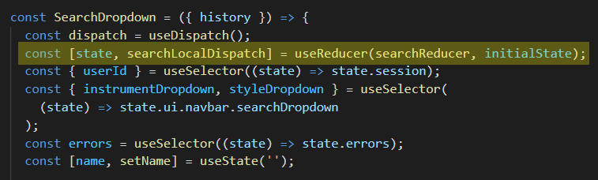
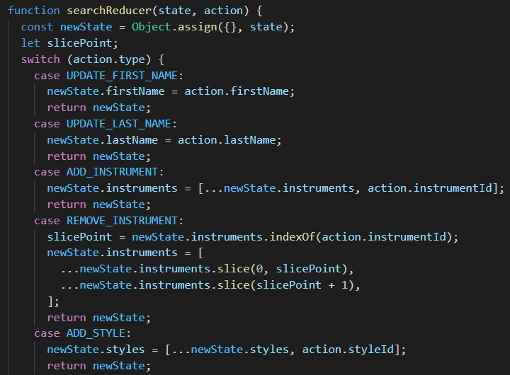

When the user selects instruments and styles they want in their search query, they do so with the help of the custom **Checkbox** component. The component renders a label and a checkbox. Then, based on the changing state of the checkbox it calls functions from the context it is consuming which dispatch actions to the **searchReducer**. The **searchReducer** function then handles the adequate changes to the search query's state.

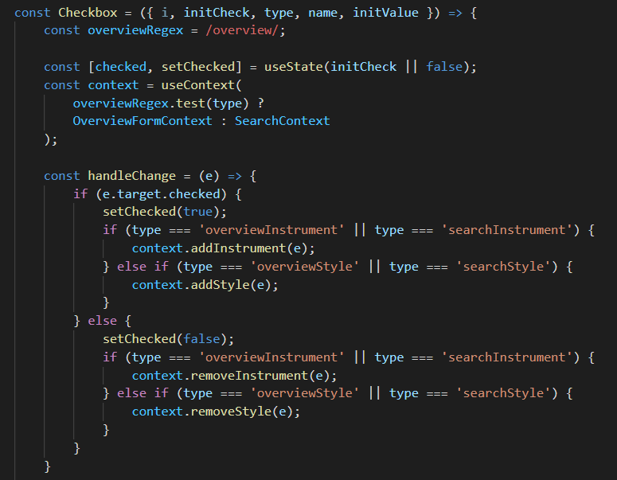

Next, when the user submits their search all of the **SearchDropdown's state data** the is passed into a **Redux thunk**. The thunk makes an AJAX request to the Flask backend and if the response is okay, dispatches an action to the store that updates the searchResults slice of the session state.

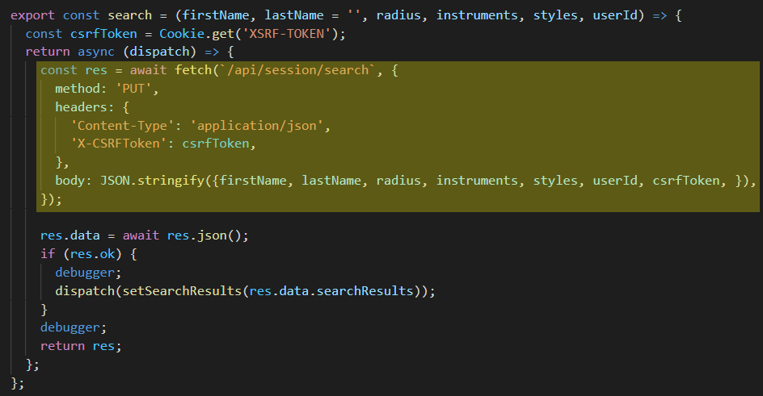
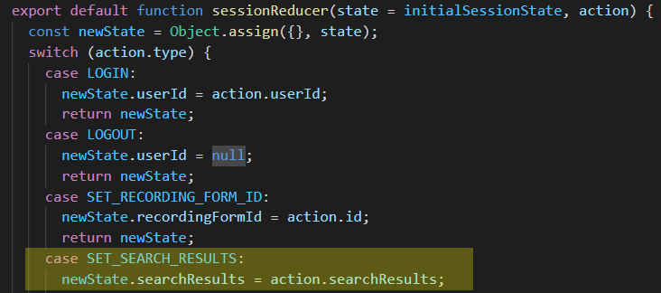

On the back end, once the route is hit, the Flask server handles the interaction of searching the database. If the body of the request provided a **name**, add that to the database query. Otherwise, just search for musicians **within the mile radius** provided that are **not the user that sent the request** and play the **instruments** and **styles** that the user requested. The server returns the response of that query to the client.

The **reverse_haversine** function handles the complexity of determining the **minimum and maximum latitudes and longitudes** of a given mile radius. The reason for using this function was to reduce the number of calls to the Google Maps API, as they can be quite expensive if used extensively enough. For more info on the application of this formula, visit the following link: [http://janmatuschek.de/LatitudeLongitudeBoundingCoordinates](http://janmatuschek.de/latitudelongitudeboundingcoordinates)

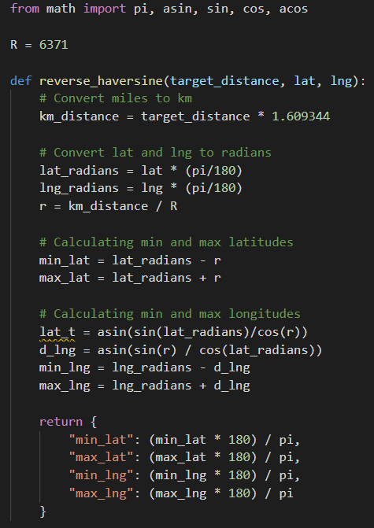

**Updating a Profile Picture**

On Player Seeking Player, a user can update their profile picture at any time once they have an account. Here's an example:

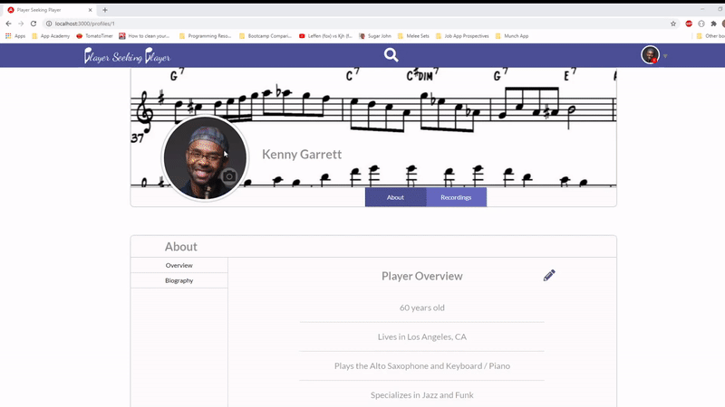

 

The **ProfilePicFormModal** component houses all of the state necessary to accomplish updating the profile picture. It tracks the picture file currently being used, a ref for the image passed into the **Cropper** component (more on that to come), the actual crop itself with a default aspect ratio of 1:1, and the current fileName. It passes these values and functions that set these values into **a context** so nested components can access them.

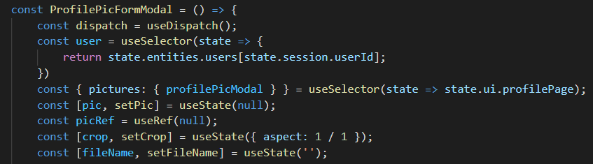

 

The **ProfilePicForm** component renders what is being shown to the user. If there is no picture selected, it renders a label which when clicked on brings up file input selector. If there is a picture selected it renders the custom **Cropper** component, which houses all of the logic for the **ReactCrop** component from the **react-image-crop** library.

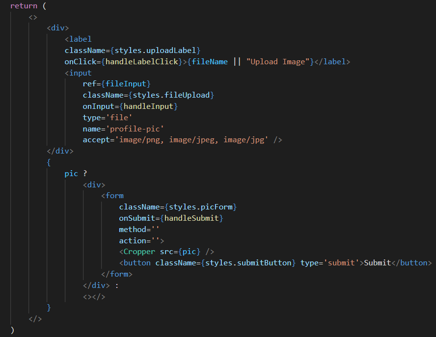
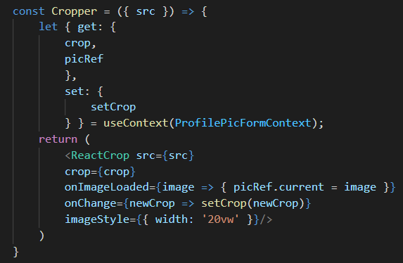

When the form in the **ProfilePicForm** is submitted, it first gets the picture rended within the crop before sending an AJAX request via Redux thunk. The **getCroppedImage** function uses a **canvas DOM node with** a **2d context** to asynchronously redraw the image between the crop and convert it into a Data URL for a **png with a base64 encoded string**. That string is then sent as part of the Redux thunk's AJAX request to the backend to update the user's profile picture.

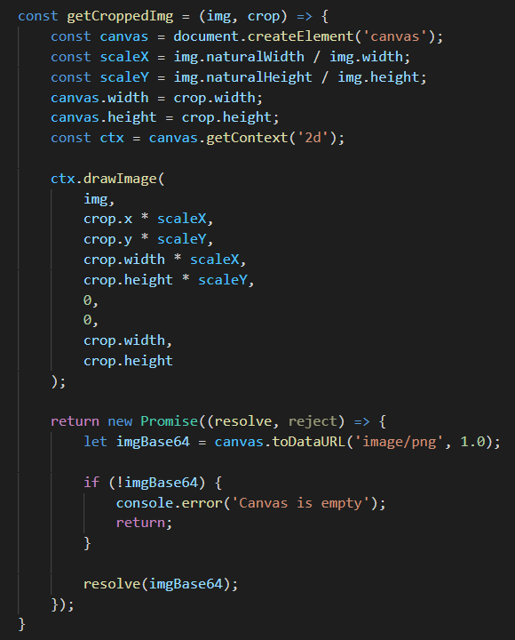
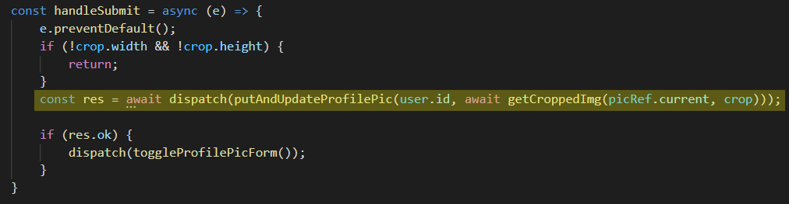

Once the route has been hit on the Flask back end, the sever takes just the relevant string data from the **base64 encoded image**, decodes the string, and **uploads it to an AWS S3 bucket**. On successful upload, the server queries the database for the corresponsing profile and updates the profile picture link to the newly uploaded image. The new profile data is then returned to the client.

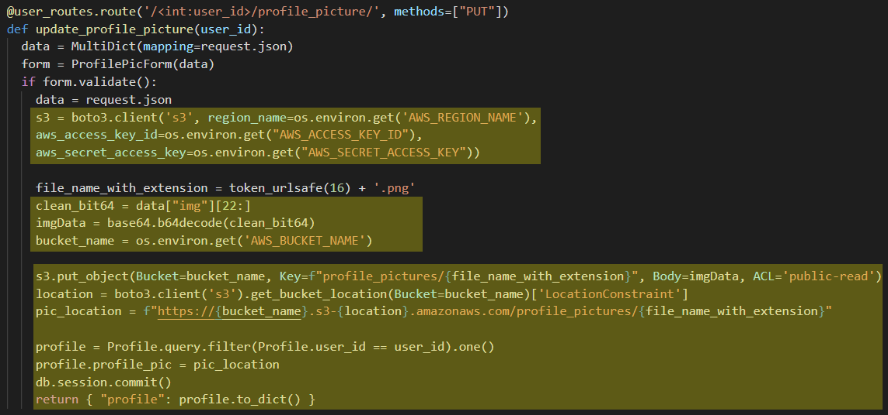

Finally, once the Redux thunk receives an okay response, it dispatches an action to update the user's profile picture which is handled by the **usersReducer**.

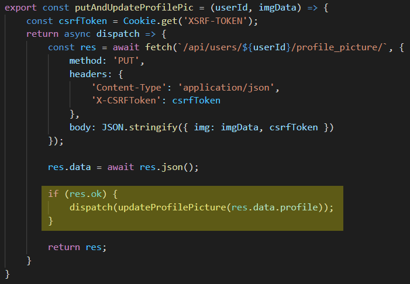

<h2 id="futurefeatures">Future Features</h2>

- Scheduling rehearsals for your band
- Rehearsal spaces being able to list their venue on the site
- Booking rehearsal spaces for rehearsals
- Messaging

<h2 id="credits">Credits</h2>

- The **reverse_haversine** formula used in calculating minimum and maximum latitudes and longitudes for a mile radius is based off of this article: [http://janmatuschek.de/LatitudeLongitudeBoundingCoordinates](http://janmatuschek.de/latitudelongitudeboundingcoordinates)
- The **react-image-crop** library can be found here: [https://github.com/DominicTobias/react-image-crop](https://github.com/DominicTobias/react-image-crop)
