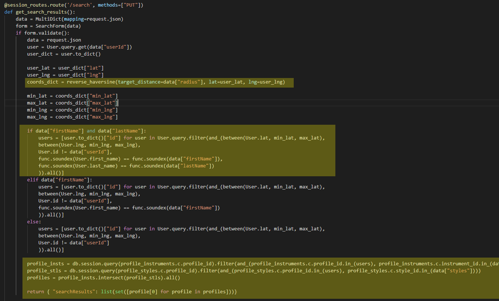

<h2 align="center">The social media / networking site for musicians</h2>

## Table of Contents

- ### [About](#about)
- ### [Features & Demo](#featuresanddemo)
- ### [Code Snippets](#codesnippets)
- ### [Future Features](#futurefeatures)
- ### [Credits](#credits)

<h2 id="about">About</h2>

<a class="logoLink" href="https://player-seeking-player.herokuapp.com"><strong>Player Seeking Player</strong></a> is a fullstack video / notetaking application built in <strong>React / Redux, Flask, Python, and PostgreSQL</strong> that aims to <em><strong>ease the difficulty of networking with local musicians</strong></em> in the COVID-19 era.
  

It is a social media application which allows users to <em><strong>post recordings</strong></em>, <em><strong>search for other users by instrument and preferred styles</em></strong>, and <em><strong>create bands</strong></em> all in the interest of managing the networking and collaboration of local musicians. It is my hope that it will help hobbyist and professional musicians alike manage their musical endeavors.

<h2 id="featuresanddemo">Features And Demo</h2>

### Auth:

Users can...

- Sign in as a demo user if they don't have an account
- Create an account
- Sign into an existing account

 

### Profiles / Recordings:

Users can...

- Create a profile on new account creation
- Edit the content of their profile information like location, instruments, styles, etc.
- Add / update their profile picture
- Manage recordings on their profile:
  - Add a recording
  - Rename a recording
  - Edit a recording's details

 

### Search:

Users can search for other musicians based on...

- Name
- Mile Radius
- Instrument
- Style

 

### Bands:

Users can...

- Create a band of a specific style
- Edit a band's name / style
- Manage the membership of a band they have created

 

### Invitations:

Users can...

- Invite other users to bands they have created
- Accept or decline pending invitations to other bands
- Delete invitations they have sent to other users

 

### Demo:

For a look at what using <a href="https://player-seeking-player.herokuapp.com"><strong>Player Seeking Player</strong></a> is normally like, check out this video demonstration by its developer, Panayiotis Dimopoulos!

<h2 id="codesnippets">Code Snippets</h2>

**Search**

On Player Seeking Player, a user can search for other musicians based on their name, mile radius, instrument(s), and preferred style(s). Here's an example:

 

The **SearchDropdown** component, which houses all of the information about a user's search query, uses a **useReducer** React hook to manage its complex state of what name is entered, what mile radius the user has chosen, and which instruments and styles the user is searching for as well.

The **searchReducer** function is responsible for handling all of the logic for how the components state is altered based on user interaction with the dropdown.

When the user selects instruments and styles they want in their search query they do so with the help of the custom **Checkbox** component. The component renders a label and a checkbox. Then, based on the changing state of the checkbox it calls functions from the context it is consuming to dispatch actions to the **searchReducer** which manages the search query's state.

Next, when the user submits their search all of its the is passed into a Redux thunk. The thunk makes an AJAX request to the Flask backend and if the response is okay dispatches an action to the Redux store that updates the searchResults slice of the session state.

On the backend, once the route is hit by the request, the Flask server handles the interaction of searching the database. If the body of the request provided a **name**, add that to the database query. Otherwise, just search for musicians **within the mile radius** provided that are not the user that sent the request and play the **instruments** and **styles** that the user requested. The server returns the response of that query to the client.

The **reverse_haversine** function handles the complexity of determining the minimum and maximum latitudes and longitudes of a given mile radius. The reason for using this function was to reduce the number of calls to the Google Maps API, as they can be quite expensive if used extensively enough. For more info on the application of this formula, visit the following link: sdflkdsjdslkfdjfs

**Updating a Profile Picture**

On Player Seeking Player, a user can update their profile picture at any time once they have an account. Here's an example:

 

The **ProfilePicFormModal** component houses all of the state necessary to accomplish updating the profile picture. It tracks the picture file currently being used, a ref for the image passed into the **Cropper** component (more on that to come), the actual crop itself with a default aspect ratio of 1:1, and the current fileName. It passes these values and functions that set these values into a context so nested components can access them.

 

The **ProfilePicForm** component renders what is being shown to the user. If there is no picture selected, it renders a label which when clicked on brings up a file input. If there is a picture selected it renders the custom **Cropper** component. The **ProfilePicForm** component also handles what happens when the form is submitted, which we'll revisit.

<h2 id="futurefeatures">Future Features</h2>

- Scheduling rehearsals for your band
- Rehearsal spaces being able to list their venue on the site
- Booking rehearsal spaces for rehearsals
- Messaging

<h2 id="credits">Credits</h2>

- Placeholder
